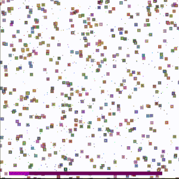

# Chance Meeting

<p align="center">
  
</p>

## The Details

### Description

- Chance meeting is a simulation that answers the age old question; How probable is it to meet your friends while traveling around the wolrd?
- The program is divided in two stages:  
  - The simulation stage
  - The data analysis stage
- The simulation phase uses C++ and [SFML](https://www.sfml-dev.org/) for the graphical representation. The simulation  will for an allocated number of seconds and after it terminates it will proceed to dump the data gathered into a couple of `.csv` files. After dumping the data, the C++ program will internally run the data analysis script.
- The data analysis stage is simply a python script that will take the `.csv` files that were generated by the simulation stage, and generate the graphs with the analysis outputs. The current script uses Pandas and Matplotlib to create some graphs but the actual outputs and data recorder will be refined later.

### How it works

- In every simualtion step, each agent will head towards their assigned target city. If an agent doesn't have a target city it will pick a random city. Upon arriving to a city it will check the city for any of its group members and it will count the number of group member it found and store it in an array. Finally the agent will wait in the city for a random amount of time and then decide where to go next and repeat!

### The motivation and goals

- I was curious about the claim that it is actually alot more probable to meet your friends abroad than we think. I also was really curious about methods of embedding and running other languages from other languages.
- The simulation currently runs really well and gives fun visuals but lacks the nuance of the real life counterpart. It is more probable to meet your friends abroad because of many factors like famous tourist spots, seasons, proximity etc. This doesn't mean that I am not planning to add some more parameters for more constraints.
- Despite not utilizing the full power of embedded Python, it was a really fun start and it gives me ideas about future projects and improvements for this project.
- The future plans for this project include better statistics, more constraints, visual overhalls , and real time data analysis and plotting.

#### Some Useful definitions

- **An agent** is simple representation of a person. Each agent has a position, velocity, target and waiting time. The agent will also be assigned a group.
- **A city** is basically a container and a destination for the agents

---

## How to build

### Requirements

- g++
- [Python 3.10](https://www.python.org/downloads/release/python-3100/)
- [SFML](https://www.sfml-dev.org/)
- [Pandas](https://pandas.pydata.org/)
- [Matplotlib](https://matplotlib.org/)
- [VScode](https://code.visualstudio.com/download) (Optional)

### Through VScode

- Either open the folder in  [VScode](https://code.visualstudio.com/download) and press the run button

### Using g++

- Simple run the following command in the terminal

```shell
g++ -std=c++20 simulation.cpp -lsfml-graphics -lsfml-system -lsfml-audio -lsfml-window -lGL -lpython3.10 -o ./exec/ChanceMeeting && ./exec/ChanceMeeting
```

### Controls

- Pan around with WASD
- Zoom in and out using the scroll wheel

---

## Current To-do

- [ ] Improve the gathered statistics
- [ ] Improve generated graphs
- [ ] Find better agent representation
